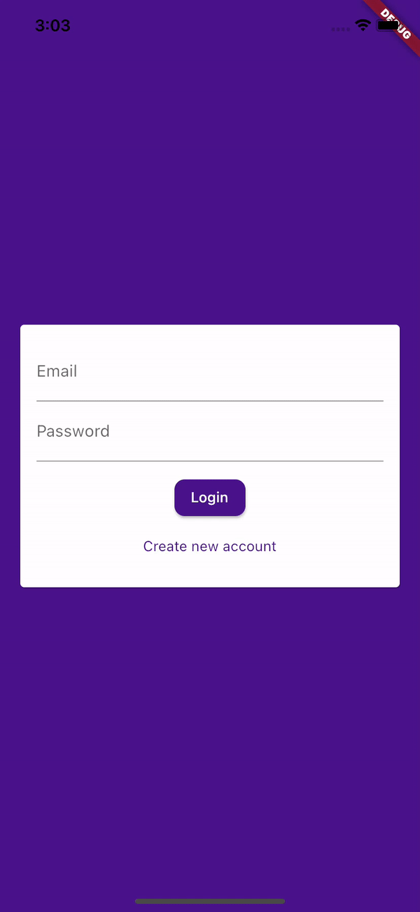
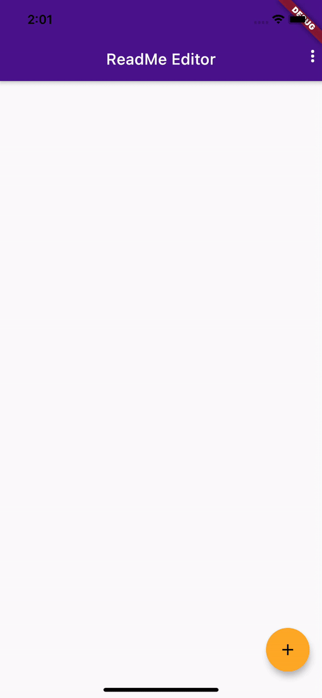
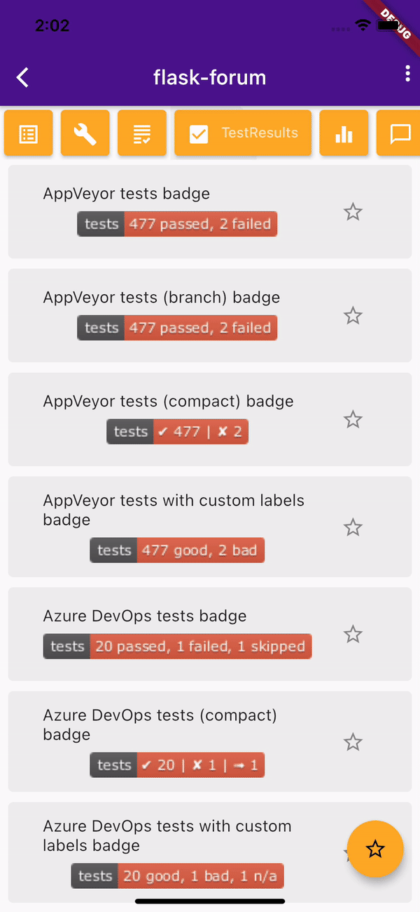
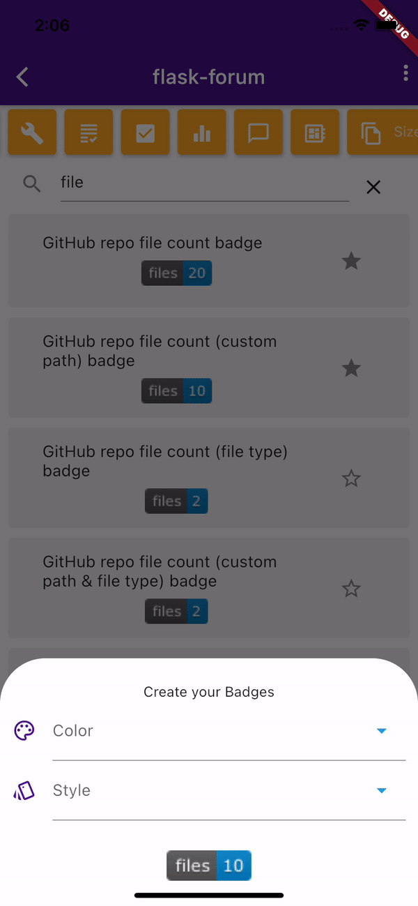

# Shield.io App

A mobile version of the famous site [shield.io](https://shields.io/)

 

## Features

- firebase authentication
- crud system for the readme
- save your favorite badges
- save your repositories readme (check with github api if repo exists)
    so you don’t always have to put the repo name and the username
    
- search the badge in the categories or global list
- see only your favorite badges in categories or global list

 

